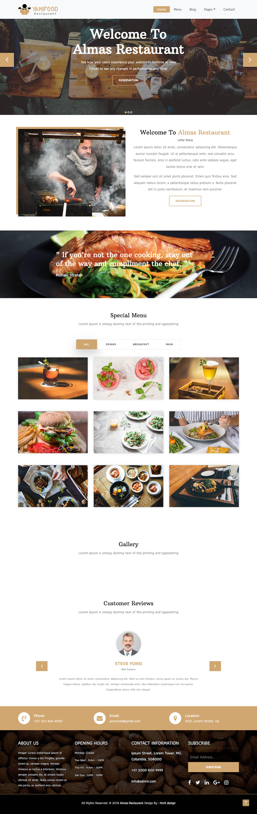
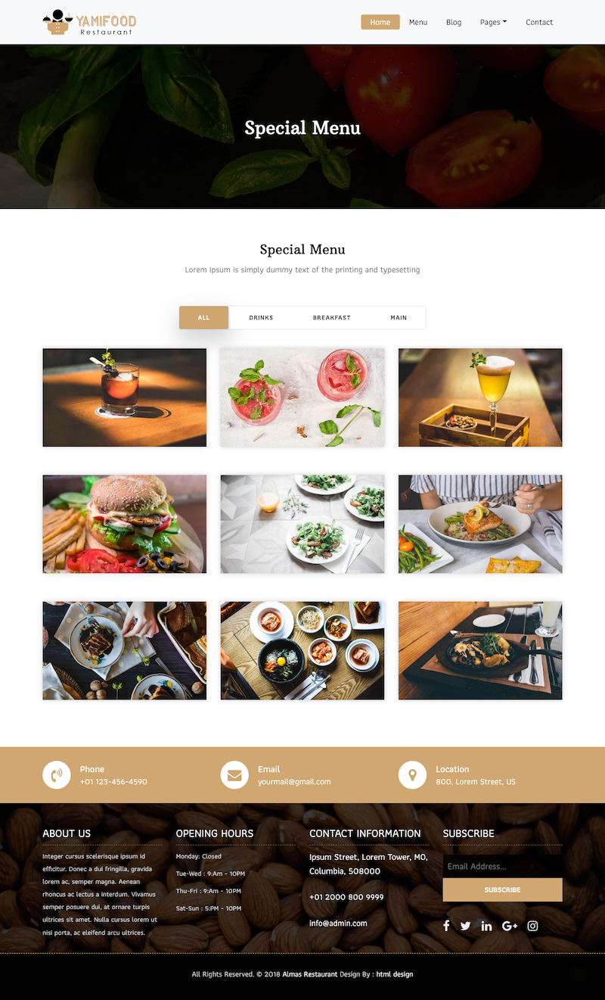
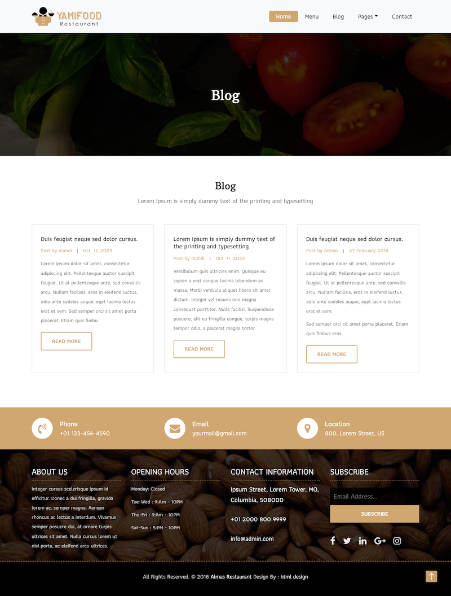
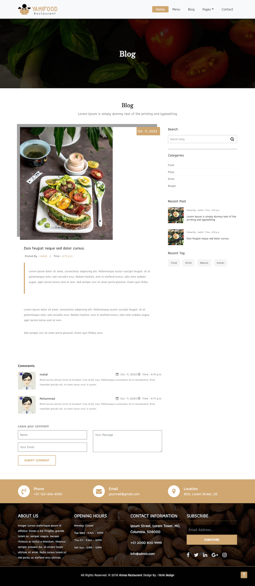
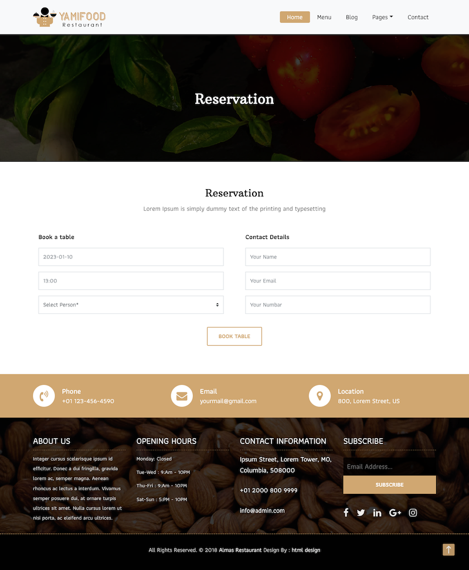
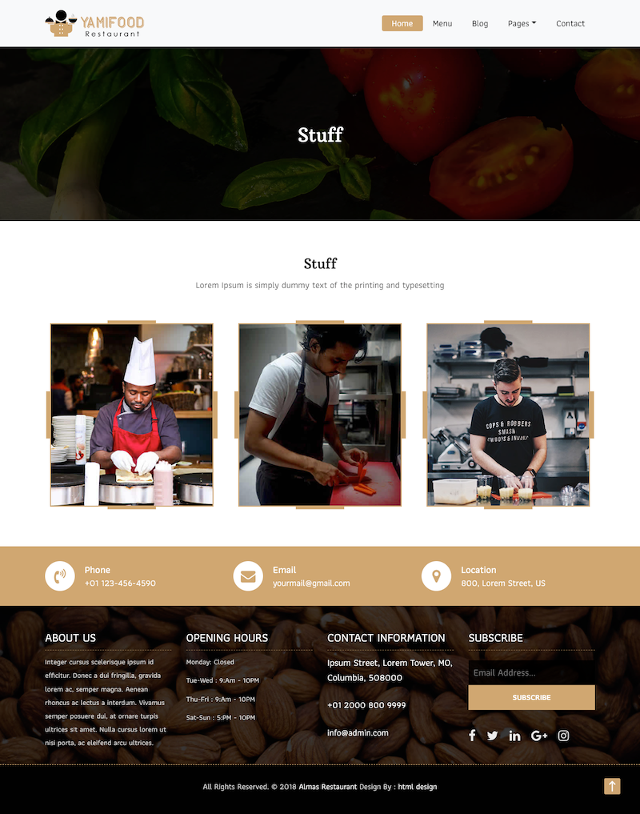
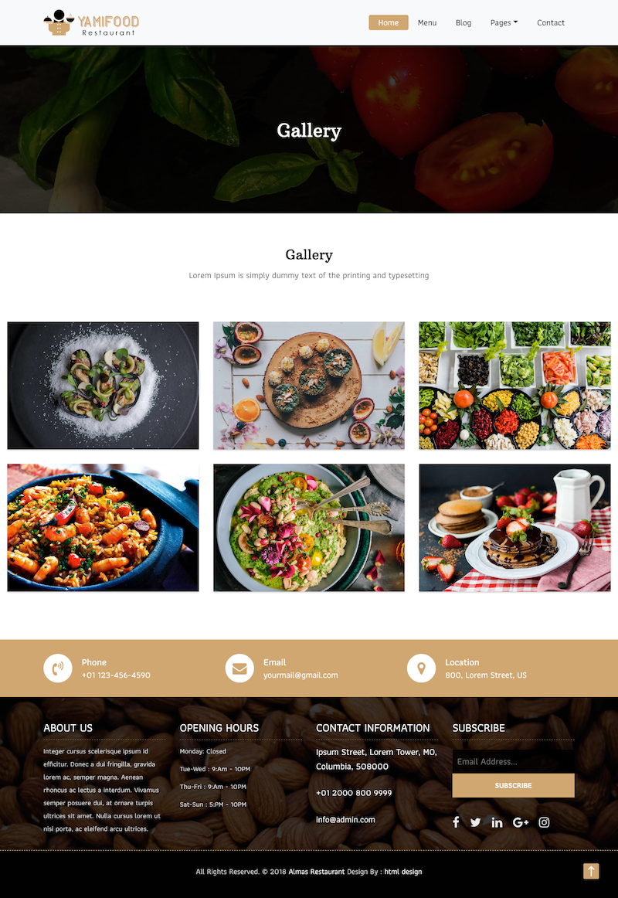
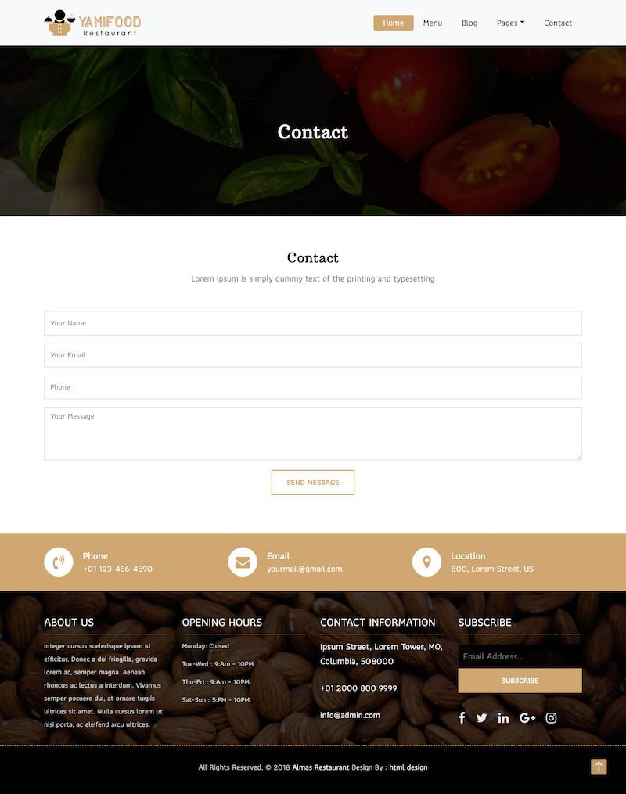

# Restaurant Django Project README

Welcome to the Restaurant Django project! This README provides an overview of the project structure, its apps, and key functionalities. Please refer to this guide for a better understanding of how to navigate and utilize this project.

## Project Overview

The Restaurant project is a web application built with Django, designed to manage various aspects of a restaurant's online presence. It includes several apps to handle different functionalities:

- **Blog App**: This app is responsible for managing restaurant blogs, comments, tags, and categories. Users can view blog posts, their details, tags, categories, and perform blog searches.

- **Food App**: This app focuses on food items and their galleries. Users can view food listings, menus, food details, and food galleries.

- **Reservation App**: Users can request table reservations and provide feedback via the Contact Us form. This app includes reservation and contact models and corresponding forms for user communication.

- **Staff App**: This app stores information about the restaurant's staff, showcasing their skills.

## Key Features

### Blog App

- **Models**: The Blog app includes models for Blog posts, Comments, Tags, and Categories.

- **Views**: Function-based views are used to display blog listings, details, tags, categories, and provide a search feature.

### Food App

- **Models**: This app has models for Food items and Galleries.

- **Views**: Function-based views allow users to explore food listings, menus, food details, and galleries.

### Reservation App

- **Models**: The Reservation and ContactUs models are used to handle table reservation requests and user feedback.

- **Forms**: ReservationForm and ContactUsForm enable users to communicate with the restaurant.

- **Views**: The `reserve_view` allows users to make reservation requests, while `contact_us_view` facilitates feedback and suggestions.

### Staff App

- **Models**: The Staff model stores information about the restaurant's staff, including their skills.

### Admin Panel

- **Admin Access**: Administrators can use the Django admin panel to add, update, and delete food items, menus, galleries, staff members, and banners.

- **Reservation Management**: Admins can view the reservation list and messages sent by users through the Contact Us form.

### CKEditor Integration

- **High-Feature Text Editor**: The project integrates django_ckeditor_5, providing a powerful text editor for administrators to manage blog posts and other textual content.

### Database

- **Database**: PostgreSQL is used to store restaurant data, ensuring robust data management.

### Media Storage

- **Media Directory**: The project stores images and media files in a designated media directory.

### Templates

- **HTML/CSS Templates**: HTML and CSS templates are used to structure the project's user interface.

## Getting Started

1. **Installation**: Make sure you have Django and other project dependencies installed. You can use virtual environments to manage your dependencies.

2. **Database Setup**: Configure PostgreSQL as your database. Update database settings in the project's settings.py file.

3. **Migrations**: Run database migrations to create tables for the models: `python manage.py makemigrations` and `python manage.py migrate`.

4. **Superuser**: Create an admin superuser with `python manage.py createsuperuser` to access the Django admin panel.

5. **Templates**: Customize HTML and CSS templates for the user interface.

6. **Run the Server**: Start the Django development server with `python manage.py runserver`.

7. **Access the Admin Panel**: Go to `/admin` in your browser to access the admin panel. Here, you can manage blog posts, food items, reservations, and more.

## Technologies Used

- **Django**: Web framework for project structure and functionality.
- **PostgreSQL**: Database system for data storage.
- **django_ckeditor_5**: Enhanced text editor for content management.
- **HTML/CSS**: Templates for the user interface.

## Project Overview


<hr>



<hr>



<hr>



<hr>



<hr>



<hr>



<hr>



<hr>

## Project Structure

```plaintext
restaurant_project/
|-- blog/
|   |-- models.py
|   |-- views.py
|   |-- ...
|-- food/
|   |-- models.py
|   |-- views.py
|   |-- ...
|-- reservation/
|   |-- models.py
|   |-- forms.py
|   |-- views.py
|   |-- ...
|-- staff/
|   |-- models.py
|   |-- ...
|-- media/
|-- templates/
|-- ...


